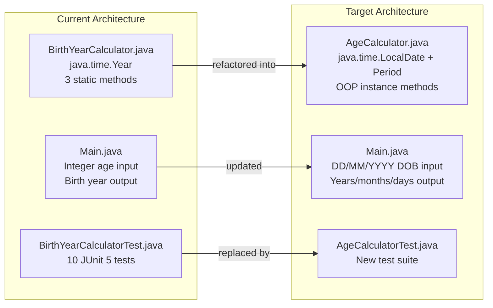

# Technical Specification

# 0. Agent Action Plan

## 0.1 Intent Clarification

### 0.1.1 Core Refactoring Objective

Based on the prompt, the Blitzy platform understands that the refactoring objective is to **transform the existing Birth Year Calculator Java console application into an Age Calculator** that accepts a user's Date of Birth (DOB) in `DD/MM/YYYY` format and computes the exact age in years, months, and days using the modern `java.time` API.

- **Refactoring type:** Code structure + Functional transformation + API migration
- **Target repository:** Same repository (in-place refactoring)
- **Refactoring goals:**
  - **Input model transformation:** Replace the current integer-age input (`Enter your age: 30`) with a date-of-birth string input (`Enter your Date of Birth (DD/MM/YYYY): 15/08/1998`)
  - **Core API migration:** Migrate from `java.time.Year` (single year arithmetic) to `java.time.LocalDate`, `java.time.Period`, and `java.time.format.DateTimeFormatter` (full date-based age computation)
  - **Output model transformation:** Replace the birth-year output (`you were born in 1996`) with an exact-age output (`Your age is 27 years, 6 months, and 15 days.`)
  - **Validation overhaul:** Replace simple `age > 0` validation with date-aware validation including future-date rejection, invalid-date detection (e.g., `31/02/2020`), and format enforcement for `DD/MM/YYYY`
  - **OOP adoption:** Refactor the existing static utility class pattern (`BirthYearCalculator` with `public static` methods) into an Object-Oriented design following encapsulation and single-responsibility principles
  - **Class and file renaming:** Rename `BirthYearCalculator.java` to `AgeCalculator.java` and `BirthYearCalculatorTest.java` to `AgeCalculatorTest.java` to reflect the new domain
  - **Test suite replacement:** Replace the existing 10 JUnit 5 tests with a new test suite covering normal DOB, leap-year DOB (`29/02/2000`), invalid dates (`31/02/2020`), future dates, and wrong-format inputs
  - **Project identity update:** Update Maven artifact coordinates, project name, and description from "Birth Year Calculator" to "Age Calculator"
  - **Documentation rewrite:** Update `README.md` to reflect the new application purpose, usage examples, and feature set
- **Implicit requirements surfaced:**
  - The `Main.java` entry point must continue to serve as the JAR manifest `Main-Class`
  - The interactive loop and exit sentinel (`exit`/`quit`) behavior must be preserved
  - Leap-year correctness is implicitly handled by `java.time.LocalDate` and `java.time.Period`, which natively support February 29 validation and period arithmetic across leap boundaries
  - The existing separation of concerns (I/O in `Main.java`, logic in the calculator class) must be maintained and strengthened under OOP principles
  - The `DD/MM/YYYY` format requires a custom `DateTimeFormatter` pattern (`"dd/MM/yyyy"`) since it is not a default ISO format

### 0.1.2 Technical Interpretation

This refactoring translates to the following technical transformation strategy:

- **Domain logic class:** `BirthYearCalculator.java` (86 lines, 3 static methods, import `java.time.Year`) is replaced by `AgeCalculator.java` — a new class importing `java.time.LocalDate`, `java.time.Period`, and `java.time.format.DateTimeFormatter`. The new class provides methods for parsing DOB strings, validating date inputs, and computing the age as a `Period` object yielding years, months, and days.
- **CLI orchestration class:** `Main.java` (124 lines) is updated to prompt for DOB instead of age, delegate parsing and validation to `AgeCalculator`, and format the output as `Your age is X years, Y months, and Z days.`
- **Test class:** `BirthYearCalculatorTest.java` (205 lines, 10 tests) is replaced by `AgeCalculatorTest.java` with new test cases covering the five user-specified scenarios: normal DOB, leap-year DOB, invalid date, future date, and wrong-format input.
- **Build configuration:** `pom.xml` is updated for new artifact identity (`age-calculator`) while preserving the Java 21 compiler release, JUnit 5.14.2 BOM, and all three build plugins.
- **Documentation:** `README.md` is fully rewritten to document the new Age Calculator application including prerequisites, project structure, build instructions, usage examples, features, and technology stack.




## 0.2 Source Analysis

### 0.2.1 Comprehensive Source File Discovery

The repository is a compact, focused Java console application with all source files residing in the default package (no `package` declaration). The complete file inventory requiring refactoring is enumerated below.

**Current Structure:**

```
birth-year-calculator/
├── pom.xml                                    # Maven build descriptor (118 lines)
├── README.md                                  # Project documentation (153 lines)
├── src/
│   ├── main/
│   │   └── java/
│   │       ├── BirthYearCalculator.java       # Domain logic: 86 lines, 3 static methods
│   │       └── Main.java                      # CLI entry point: 124 lines
│   └── test/
│       └── java/
│           └── BirthYearCalculatorTest.java   # JUnit 5 tests: 205 lines, 10 tests
└── blitzy/
    └── documentation/                          # Governance docs (out of scope)
```

### 0.2.2 Source File Details

**`src/main/java/BirthYearCalculator.java`** — Domain Computation Layer (86 lines)

- **Import:** `java.time.Year` (single import)
- **Class type:** Utility class with all `public static` methods, no constructor, no instance state
- **Public API surface:**
  - `calculateBirthYear(int age)` — returns `Year.now().getValue() - age`
  - `isValidAge(int age)` — returns `age > 0`
  - `calculateBirthYear(int age, boolean birthdayOccurred)` — adjusts birth year by `-1` when `birthdayOccurred == false`
- **Refactoring impact:** Entire class must be replaced. The domain model changes from integer arithmetic (`currentYear - age`) to date-based period computation (`Period.between(birthDate, LocalDate.now())`). All three methods are obsolete in the new architecture.

**`src/main/java/Main.java`** — CLI Orchestration Layer (124 lines)

- **Import:** `java.util.Scanner`
- **Input mechanism:** `Scanner.nextLine()` reads a string, then `Integer.parseInt()` converts to age
- **Output format:** `"If you are " + age + " years old, you were born in " + birthYear + "."`
- **Validation pipeline:** EOF check → Sentinel check → Numeric parse → `isValidAge()` delegation
- **Features preserved in refactoring:** Welcome banner, `while(true)` loop, exit sentinel (`exit`/`quit`), `scanner.close()`, generic exception safety net
- **Refactoring impact:** Input parsing changes from `Integer.parseInt()` to `LocalDate.parse()` with `DateTimeFormatter`. Output format changes to `"Your age is X years, Y months, and Z days."`. Validation changes from numeric to date-based.

**`src/test/java/BirthYearCalculatorTest.java`** — Test Suite (205 lines)

- **Framework:** JUnit 5 (Jupiter) with `@Test`, `@DisplayName`, assertions
- **Import:** `java.time.Year`, JUnit Jupiter API
- **Test count:** 10 tests covering calculation correctness, validation logic, birthday edge case, and dynamic year verification
- **Refactoring impact:** Entire test class must be replaced. All 10 tests target APIs that no longer exist in the new architecture. New tests must cover DOB parsing, date validation, period computation, and error handling for the five user-specified scenarios.

**`pom.xml`** — Build Configuration (118 lines)

- **Coordinates:** `com.birthyearcalculator:birth-year-calculator:1.0-SNAPSHOT`
- **Compiler:** `maven.compiler.release=21` (Java 21 LTS)
- **Dependencies:** JUnit 5.14.2 BOM (test-scoped only), zero runtime dependencies
- **Plugins:** `maven-compiler-plugin` 3.15.0, `maven-surefire-plugin` 3.5.5, `maven-jar-plugin` 3.4.2 (mainClass: `Main`)
- **Refactoring impact:** Project coordinates, name, and description must be updated. Compiler release, dependency versions, and plugin configurations remain unchanged.

**`README.md`** — Project Documentation (153 lines)

- **Contents:** Prerequisites, project structure, build instructions, usage examples, feature list, technology stack
- **Refactoring impact:** Full rewrite required. Every section references Birth Year Calculator functionality, usage examples, and feature descriptions that no longer apply.

### 0.2.3 Source File Inventory Summary

| Source File | Lines | Imports to Remove | Imports to Add | Refactoring Severity |
|---|---|---|---|---|
| `src/main/java/BirthYearCalculator.java` | 86 | `java.time.Year` | `java.time.LocalDate`, `java.time.Period`, `java.time.format.DateTimeFormatter` | **Critical** — full replacement |
| `src/main/java/Main.java` | 124 | None | None (delegates to new calculator) | **High** — input/output/validation rewrite |
| `src/test/java/BirthYearCalculatorTest.java` | 205 | `java.time.Year` | `java.time.LocalDate`, `java.time.Period` | **Critical** — full replacement |
| `pom.xml` | 118 | N/A | N/A | **Low** — metadata-only changes |
| `README.md` | 153 | N/A | N/A | **High** — full documentation rewrite |


## 0.3 Scope Boundaries

### 0.3.1 Exhaustively In Scope

**Source transformations:**
- `src/main/java/BirthYearCalculator.java` — replaced by `src/main/java/AgeCalculator.java`
- `src/main/java/Main.java` — updated for DOB input, age output, and date validation
- `src/test/java/BirthYearCalculatorTest.java` — replaced by `src/test/java/AgeCalculatorTest.java`

**Test updates:**
- `src/test/java/AgeCalculatorTest.java` — new test suite covering:
  - Normal DOB computation (e.g., `15/08/1998`)
  - Leap-year DOB handling (e.g., `29/02/2000`)
  - Invalid date rejection (e.g., `31/02/2020`)
  - Future date rejection
  - Wrong format input rejection
  - Edge cases: today's date as DOB, very old DOB, boundary months and days

**Configuration updates:**
- `pom.xml` — update `groupId`, `artifactId`, `name`, `description`, and JAR manifest `mainClass` reference (remains `Main`)

**Documentation updates:**
- `README.md` — full rewrite for Age Calculator application (prerequisites, structure, build instructions, usage examples, features, tech stack)

**Import corrections:**
- `src/main/java/AgeCalculator.java` — add `java.time.LocalDate`, `java.time.Period`, `java.time.format.DateTimeFormatter`; remove `java.time.Year`
- `src/main/java/Main.java` — update references from `BirthYearCalculator` to `AgeCalculator`; add `java.time.format.DateTimeParseException` for catch block
- `src/test/java/AgeCalculatorTest.java` — add `java.time.LocalDate`, `java.time.Period`; remove `java.time.Year`; update class references from `BirthYearCalculator` to `AgeCalculator`

**File lifecycle operations:**
- `src/main/java/BirthYearCalculator.java` — deleted (replaced by `AgeCalculator.java`)
- `src/test/java/BirthYearCalculatorTest.java` — deleted (replaced by `AgeCalculatorTest.java`)
- `src/main/java/AgeCalculator.java` — created (new domain logic class)
- `src/test/java/AgeCalculatorTest.java` — created (new test class)

### 0.3.2 Explicitly Out of Scope

- **GUI implementation:** The user lists Java Swing or JavaFX GUI as an optional enhancement. No GUI code is included in this refactoring scope. The application remains a console-only program.
- **Total age in months and days:** Listed as optional. Not included unless explicitly requested.
- **Countdown to next birthday:** Listed as optional. Not included unless explicitly requested.
- **Reusable utility class extraction:** Listed as optional. The `AgeCalculator` class itself serves as the reusable component.
- **Package structure introduction:** The current codebase uses the default package (no `package` declaration). Introducing Java packages (e.g., `com.agecalculator`) is out of scope to minimize structural disruption and maintain consistency with the existing architecture.
- **`blitzy/` directory:** All governance and documentation files under `blitzy/documentation/` are out of scope and must not be modified.
- **Third-party runtime dependencies:** No external libraries beyond the JDK are introduced. The application remains a zero-runtime-dependency artifact.
- **Java version change:** The project remains on Java 21 LTS. No upgrade or downgrade is performed.
- **Maven plugin version changes:** All three Maven plugins (`maven-compiler-plugin` 3.15.0, `maven-surefire-plugin` 3.5.5, `maven-jar-plugin` 3.4.2) retain their current versions.
- **JUnit version change:** JUnit 5.14.2 is retained as-is.


## 0.4 Target Design

### 0.4.1 Refactored Structure Planning

The target architecture preserves the existing directory layout and Maven conventions while renaming domain files to reflect the new Age Calculator purpose.

**Target Architecture:**

```
age-calculator/
├── pom.xml                                    # Updated Maven build descriptor
├── README.md                                  # Rewritten project documentation
├── src/
│   ├── main/
│   │   └── java/
│   │       ├── AgeCalculator.java             # New domain logic: DOB parsing, validation, age computation
│   │       └── Main.java                      # Updated CLI: DOB input, age output
│   └── test/
│       └── java/
│           └── AgeCalculatorTest.java         # New test suite: 5+ scenarios
└── blitzy/
    └── documentation/                          # Unchanged governance docs
```

**Key structural changes:**
- `BirthYearCalculator.java` → removed, replaced by `AgeCalculator.java`
- `BirthYearCalculatorTest.java` → removed, replaced by `AgeCalculatorTest.java`
- `Main.java` → updated in place (same filename, same manifest entry)
- `pom.xml` → updated coordinates and metadata
- `README.md` → fully rewritten

### 0.4.2 Web Search Research Conducted

Research was conducted to validate the implementation approach for the Java `java.time` API age calculation pattern:

- **`Period.between(LocalDate, LocalDate)`** is the standard Java approach for computing the difference between two dates in years, months, and days. The `Period` class natively handles leap years and variable-length months without manual arithmetic.
- **`DateTimeFormatter.ofPattern("dd/MM/yyyy")`** is the correct formatter for parsing the user-specified `DD/MM/YYYY` input format. The `ResolverStyle.STRICT` setting should be used with `DateTimeFormatter` to reject invalid dates like `31/02/2020`.
- **`DateTimeParseException`** is the exception thrown by `LocalDate.parse()` when the input string does not match the expected format or represents an invalid calendar date, making it the appropriate exception to catch in the validation pipeline.
- **Future date validation** requires a simple `birthDate.isAfter(LocalDate.now())` check after successful parsing.

### 0.4.3 Design Pattern Applications

- **Object-Oriented Design:** The `AgeCalculator` class transitions from a static utility pattern to an OOP design. The class encapsulates the `DateTimeFormatter` as a class-level constant and provides well-defined instance or static methods for parsing, validation, and computation. This follows the user's explicit requirement for OOP principles.
- **Separation of Concerns:** `Main.java` continues to own all I/O operations (Scanner input, System.out output, exception messaging). `AgeCalculator.java` owns all domain logic (date parsing, validation, period computation) with zero I/O dependencies.
- **Exception Handling Strategy:** The refactored code uses a layered exception approach:
  - `DateTimeParseException` — caught for malformed or invalid date strings (covers both wrong format and impossible dates like `31/02/2020`)
  - `IllegalArgumentException` — thrown by `AgeCalculator` when DOB is a future date
  - `Exception` — generic safety net preserved from the current architecture
- **Formatter Encapsulation:** The `DateTimeFormatter` with pattern `"dd/MM/yyyy"` and `ResolverStyle.STRICT` is defined as a private static final constant inside `AgeCalculator`, preventing duplicate formatter instantiation and ensuring consistent parsing behavior.

### 0.4.4 AgeCalculator Class Design

The `AgeCalculator` class provides the following public API:

| Method Signature | Return Type | Responsibility |
|---|---|---|
| `parseDateOfBirth(String dob)` | `LocalDate` | Parses a `DD/MM/YYYY` string into a `LocalDate` using strict formatting; throws `DateTimeParseException` on invalid input |
| `validateDateOfBirth(LocalDate dob)` | `void` | Validates that the DOB is not in the future; throws `IllegalArgumentException` if DOB is after today |
| `calculateAge(LocalDate dob)` | `Period` | Computes the period between the DOB and today using `Period.between()`; returns a `Period` with years, months, and days |

The class uses:
- `java.time.LocalDate` — for representing the date of birth and current date
- `java.time.Period` — for representing the computed age as years, months, and days
- `java.time.format.DateTimeFormatter` — for parsing the `DD/MM/YYYY` input format with strict resolution


## 0.5 Transformation Mapping

### 0.5.1 File-by-File Transformation Plan

| Target File | Transformation | Source File | Key Changes |
|---|---|---|---|
| `src/main/java/AgeCalculator.java` | CREATE | `src/main/java/BirthYearCalculator.java` | Replace static utility class with OOP class; replace `java.time.Year` with `java.time.LocalDate`, `java.time.Period`, `java.time.format.DateTimeFormatter`; implement `parseDateOfBirth()`, `validateDateOfBirth()`, `calculateAge()` methods; add strict `DD/MM/YYYY` formatter; add future-date and invalid-date validation |
| `src/main/java/Main.java` | UPDATE | `src/main/java/Main.java` | Change input prompt from age to DOB (`DD/MM/YYYY`); replace `Integer.parseInt()` with DOB parsing via `AgeCalculator`; replace `NumberFormatException` catch with `DateTimeParseException` catch; update output format to `Your age is X years, Y months, and Z days.`; add `IllegalArgumentException` catch for future dates; update welcome banner text; update all references from `BirthYearCalculator` to `AgeCalculator`; preserve loop, exit sentinel, EOF guard, and scanner lifecycle |
| `src/test/java/AgeCalculatorTest.java` | CREATE | `src/test/java/BirthYearCalculatorTest.java` | Replace all 10 existing tests with new suite; add test for normal DOB (e.g., `15/08/1998`); add test for leap-year DOB (`29/02/2000`); add test for invalid date rejection (`31/02/2020`); add test for future date rejection; add test for wrong format input; add edge-case tests for boundary dates; use `java.time.LocalDate` and `java.time.Period` for assertions |
| `pom.xml` | UPDATE | `pom.xml` | Change `groupId` from `com.birthyearcalculator` to `com.agecalculator`; change `artifactId` from `birth-year-calculator` to `age-calculator`; update `<name>` to `Age Calculator`; update `<description>` to reflect DOB-based age calculation; preserve all plugin versions, compiler release, JUnit BOM, and encoding settings |
| `README.md` | UPDATE | `README.md` | Rewrite title to `Age Calculator`; update prerequisites section (Java 21, Maven 3.9+); update project structure tree with new filenames; rewrite build instructions with new JAR name (`age-calculator-1.0-SNAPSHOT.jar`); replace all usage examples with DOB input/output; rewrite feature list for date validation, period computation, and error handling; update technology stack table |

### 0.5.2 File Deletion Plan

| File to Delete | Reason |
|---|---|
| `src/main/java/BirthYearCalculator.java` | Replaced by `src/main/java/AgeCalculator.java`; all 3 public static methods are obsolete |
| `src/test/java/BirthYearCalculatorTest.java` | Replaced by `src/test/java/AgeCalculatorTest.java`; all 10 tests target obsolete APIs |

### 0.5.3 Cross-File Dependencies

**Import statement updates in `Main.java`:**
- FROM: `BirthYearCalculator.isValidAge(age)` → TO: `AgeCalculator.validateDateOfBirth(dob)`
- FROM: `BirthYearCalculator.calculateBirthYear(age)` → TO: `AgeCalculator.calculateAge(dob)`
- FROM: `BirthYearCalculator.calculateBirthYear(age, false)` → TO: removed (birthday edge case handled natively by `Period.between()`)
- ADD: `import java.time.format.DateTimeParseException;` for the new catch block

**Import statement updates in `AgeCalculatorTest.java`:**
- FROM: `import java.time.Year;` → TO: `import java.time.LocalDate;` and `import java.time.Period;`
- FROM: `BirthYearCalculator.*` references → TO: `AgeCalculator.*` references

**Configuration updates for new structure:**
- `pom.xml` line 20: `<groupId>com.agecalculator</groupId>`
- `pom.xml` line 21: `<artifactId>age-calculator</artifactId>`
- `pom.xml` line 26: `<name>Age Calculator</name>`
- `pom.xml` line 27: `<description>` updated for DOB-based age calculation
- `pom.xml` line 111: `<mainClass>Main</mainClass>` — unchanged, as the entry point class name remains `Main`

**Build output changes:**
- JAR filename changes from `birth-year-calculator-1.0-SNAPSHOT.jar` to `age-calculator-1.0-SNAPSHOT.jar`
- Execution command changes from `java -jar target/birth-year-calculator-1.0-SNAPSHOT.jar` to `java -jar target/age-calculator-1.0-SNAPSHOT.jar`

### 0.5.4 One-Phase Execution

The entire refactoring is executed by Blitzy in **one phase**. All five file transformations (2 CREATE, 2 UPDATE, 2 DELETE) are applied atomically. There is no phased rollout or incremental migration.


## 0.6 Dependency Inventory

### 0.6.1 Key Packages

All dependencies are either JDK built-in APIs or test-scoped Maven dependencies. The application has zero third-party runtime dependencies, and this characteristic is preserved after refactoring.

| Registry | Package | Version | Scope | Purpose |
|---|---|---|---|---|
| JDK 21 Built-in | `java.time.LocalDate` | JDK 21 | Runtime | Represents date-of-birth and current date without time zone |
| JDK 21 Built-in | `java.time.Period` | JDK 21 | Runtime | Computes difference between two `LocalDate` instances as years, months, days |
| JDK 21 Built-in | `java.time.format.DateTimeFormatter` | JDK 21 | Runtime | Parses `DD/MM/YYYY` input strings into `LocalDate` objects |
| JDK 21 Built-in | `java.time.format.DateTimeParseException` | JDK 21 | Runtime | Exception thrown on malformed or invalid date input |
| JDK 21 Built-in | `java.time.format.ResolverStyle` | JDK 21 | Runtime | Enforces strict date resolution to reject invalid dates like `31/02/2020` |
| JDK 21 Built-in | `java.util.Scanner` | JDK 21 | Runtime | Console input reading (preserved from current architecture) |
| Maven Central | `org.junit:junit-bom` | 5.14.2 | Test (BOM) | Aligns all JUnit 5 component versions |
| Maven Central | `org.junit.jupiter:junit-jupiter-api` | 5.14.2 | Test | JUnit 5 annotations and assertions for writing tests |
| Maven Central | `org.junit.jupiter:junit-jupiter-engine` | 5.14.2 | Test | JUnit 5 test discovery and execution engine |

**Build tooling (unchanged):**

| Tool | Version | Purpose |
|---|---|---|
| Apache Maven | 3.9+ (3.8.7 installed) | Build automation and dependency management |
| `maven-compiler-plugin` | 3.15.0 | Java 21 compilation with `--release 21` flag |
| `maven-surefire-plugin` | 3.5.5 | JUnit 5 test execution during `mvn test` phase |
| `maven-jar-plugin` | 3.4.2 | Executable JAR packaging with `Main-Class: Main` manifest |

### 0.6.2 Dependency Updates

**Import Refactoring:**

Files requiring import updates:

- `src/main/java/AgeCalculator.java` — new file, imports added:
  - `import java.time.LocalDate;`
  - `import java.time.Period;`
  - `import java.time.format.DateTimeFormatter;`
  - `import java.time.format.ResolverStyle;`

- `src/main/java/Main.java` — import changes:
  - ADD: `import java.time.format.DateTimeParseException;`
  - RETAIN: `import java.util.Scanner;`
  - No class-level import of `AgeCalculator` needed (default package, same classpath)

- `src/test/java/AgeCalculatorTest.java` — new file, imports added:
  - `import java.time.LocalDate;`
  - `import java.time.Period;`
  - `import org.junit.jupiter.api.DisplayName;`
  - `import org.junit.jupiter.api.Test;`
  - `import static org.junit.jupiter.api.Assertions.*;`

**Import transformation rules:**
- Old: `import java.time.Year;` → Removed from all files
- Old: `BirthYearCalculator.calculateBirthYear(age)` → New: `AgeCalculator.calculateAge(dob)`
- Old: `BirthYearCalculator.isValidAge(age)` → New: `AgeCalculator.validateDateOfBirth(dob)`
- Apply to: `src/main/java/Main.java`

**External Reference Updates:**
- `pom.xml` — artifact coordinates and description updated
- `README.md` — all references to `BirthYearCalculator`, `birth-year-calculator`, and birth year functionality updated


## 0.7 Refactoring Rules

### 0.7.1 Refactoring-Specific Rules

The following rules are derived from the user's explicit requirements and must be enforced throughout the refactoring:

- **Use `java.time.LocalDate`, `java.time.Period`, and `java.time.format.DateTimeFormatter` exclusively** — no deprecated `java.util.Date`, `java.util.Calendar`, or `java.text.SimpleDateFormat` classes are permitted. This extends the existing project convention that prohibits legacy date/time APIs.
- **Follow Object-Oriented Programming principles** — the new `AgeCalculator` class must demonstrate encapsulation, single responsibility, and clean method interfaces. The static utility pattern used by `BirthYearCalculator` is intentionally replaced.
- **Implement proper exception handling using `try-catch`** — the user explicitly requires `try-catch` blocks for input validation errors. `DateTimeParseException` must be caught for invalid date formats and impossible dates; `IllegalArgumentException` must be caught for future-date violations.
- **Handle leap years correctly** — the `java.time.LocalDate` API natively validates February 29 entries against leap-year rules. A DOB of `29/02/2000` must be accepted (2000 is a leap year), while `29/02/2001` must be rejected. The `ResolverStyle.STRICT` formatter setting enforces this automatically.
- **Work for users born in any valid year** — the `AgeCalculator` must not impose artificial upper or lower bounds on the birth year. Any `LocalDate` representable by the JDK is valid, subject only to the future-date check.
- **Accept input in `DD/MM/YYYY` format only** — the `DateTimeFormatter` pattern must be `"dd/MM/uuuu"` (using `uuuu` with `ResolverStyle.STRICT` for proper year validation) to match the user's specified format.
- **Display output in exact format: `Your age is X years, Y months, and Z days.`** — the output string must match this template precisely, including spacing, commas, the word "and", and the trailing period.
- **Validate that DOB is not a future date** — if `birthDate.isAfter(LocalDate.now())`, a meaningful error message must be displayed and the user must be re-prompted.
- **Display meaningful error messages for incorrect input** — distinct messages for wrong format, invalid date, and future date, following the user's requirement for actionable feedback.

### 0.7.2 Special Instructions and Constraints

- **Preserve interactive loop behavior:** The `while(true)` loop, exit sentinel detection (`exit`/`quit`), EOF guard, and `scanner.close()` resource management from the current `Main.java` must be carried forward unchanged.
- **Preserve JAR executability:** The `Main-Class: Main` manifest entry in `pom.xml` must remain functional. The application must be runnable via `java -jar target/age-calculator-1.0-SNAPSHOT.jar` after refactoring.
- **Maintain zero runtime dependencies:** No external libraries are introduced. All new functionality uses JDK 21 built-in APIs.
- **Maintain clean separation of concerns:** `AgeCalculator.java` must have zero I/O imports (`Scanner`, `System.in`, `System.out`). All user interaction remains exclusively in `Main.java`.
- **Default package preserved:** No `package` declarations are introduced. All classes remain in the default package, consistent with the existing architecture.
- **Test suite must pass:** All new tests in `AgeCalculatorTest.java` must achieve a 100% pass rate via `mvn test`.

### 0.7.3 User-Specified Test Cases

The user explicitly defined the following test scenarios that must be covered:

| Scenario | Input Example | Expected Behavior |
|---|---|---|
| ✅ Normal DOB | `15/08/1998` | Computes and displays age in years, months, and days |
| ✅ Leap year DOB | `29/02/2000` | Accepted as valid; age computed correctly |
| ❌ Invalid date | `31/02/2020` | Rejected with meaningful error message |
| ❌ Future date | Any date after today | Rejected with meaningful error message |
| ❌ Wrong format input | Non-date strings | Rejected with meaningful error message |

### 0.7.4 User-Specified Sample Input and Output

User Example — the exact input and output format the application must produce:

**Input:**
```
Enter your Date of Birth (DD/MM/YYYY): 15/08/1998
```

**Output:**
```
Your age is 27 years, 6 months, and 15 days.
```


## 0.8 References

### 0.8.1 Codebase Files and Folders Searched

The following files and folders were inspected across the repository to derive the conclusions documented in this Agent Action Plan:

| Path | Type | Purpose of Inspection |
|---|---|---|
| `/` (root) | Folder | Repository root structure discovery; identified `pom.xml`, `README.md`, `src/`, `blitzy/` |
| `src/` | Folder | Source root exploration; confirmed `src/main` and `src/test` children |
| `src/main/java/BirthYearCalculator.java` | File (86 lines) | Full source read; analyzed 3 public static methods, `java.time.Year` import, validation logic, birthday edge-case handling |
| `src/main/java/Main.java` | File (124 lines) | Full source read; analyzed Scanner input pipeline, validation flow, output format, exit sentinel, exception handling |
| `src/test/java/BirthYearCalculatorTest.java` | File (205 lines) | Full source read; analyzed 10 JUnit 5 tests, assertion patterns, dynamic year computation, `@DisplayName` annotations |
| `pom.xml` | File (118 lines) | Full source read; analyzed Maven coordinates, Java 21 compiler config, JUnit 5.14.2 BOM, 3 build plugins, JAR manifest |
| `README.md` | File (153 lines) | Full source read; analyzed prerequisites, project structure, build instructions, usage examples, feature list, tech stack |
| `blitzy/` | Folder | Confirmed contains `documentation/` subfolder only; marked out of scope |

### 0.8.2 Technical Specification Sections Retrieved

| Section | Purpose of Retrieval |
|---|---|
| 1.1 Executive Summary | Confirmed project identity, Maven coordinates, core business problem, and value proposition |
| 2.1 Feature Catalog | Cataloged all 14 existing features (F-001 through F-014) and their implementation files to assess refactoring impact |
| 3.1 Programming Languages | Confirmed Java 21 LTS requirement, compiler release flag, and platform constraints |
| 5.2 Component Details | Analyzed Domain Computation Layer and CLI Orchestration Layer responsibilities, state management, and dependency graph |
| 9.4 Project Structure Reference | Verified complete directory tree, file inventory, and component dependency map |

### 0.8.3 Web Research Conducted

| Search Query | Key Findings |
|---|---|
| `Java LocalDate Period age calculator best practices 2024` | Confirmed `Period.between(birthDate, LocalDate.now())` as the standard approach; validated use of `getYears()`, `getMonths()`, `getDays()` for decomposed age output; confirmed `DateTimeFormatter` with strict resolver style for input validation |

### 0.8.4 Environment Verification

| Check | Result |
|---|---|
| Java version installed | OpenJDK 21.0.10 (matches project requirement of Java 21 LTS) |
| Maven version installed | Apache Maven 3.8.7 (satisfies project requirement of Maven 3.9+) |
| `mvn compile` | BUILD SUCCESS |
| `mvn test` | BUILD SUCCESS — 10 tests run, 0 failures, 0 errors, 0 skipped |
| Project working directory | `/tmp/blitzy/26Feb_1/New_123_8573d5` |

### 0.8.5 Attachments

No attachments were provided for this project. No Figma URLs were specified.


